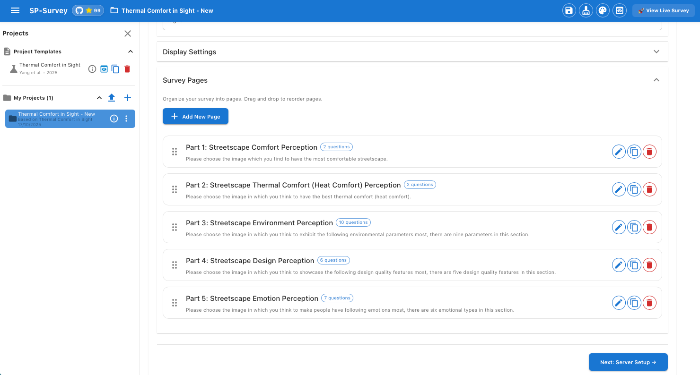

<div align="center">

# 🏙️ SP-Survey (Streetscape Perception Survey)

[](https://github.com/Sijie-Yang/Streetscape-Perception-Survey)
[](https://www.sciencedirect.com/science/article/pii/S0360132325000514)
[](https://streetscape-perception-survey.vercel.app/)
[](https://creativecommons.org/licenses/by/4.0/)
[](https://reactjs.org/)
[](https://nodejs.org/)


<strong>A professional, research-grade platform for conducting visual perception surveys.</strong>
<br>
No coding required – build surveys through an intuitive admin panel with drag-and-drop, real-time preview, and cloud integration.

🌐 <a href="https://streetscape-perception-survey.vercel.app/"><strong>Live Demo</strong></a> •
📄 <a href="https://www.sciencedirect.com/science/article/pii/S0360132325000514"><strong>Research Paper</strong></a> •
🔗 <a href="https://thermal-affordance.ual.sg"><strong>Project Website</strong></a> •
📊 <a href="https://github.com/Sijie-Yang/Thermal-Affordance"><strong>Dataset</strong></a>


&nbsp;&nbsp;&nbsp;&nbsp;


</div>

---

## 📸 Platform Overview

<p align="center">
  
</p>

<p align="center">
  <em>Complete workflow: From image dataset management to survey deployment</em>
</p>

---

## ✨ Key Features

### 🔧 **Survey Capabilities**

#### **Visual Perception Question Types**
The platform offers 16 specialized question types designed specifically for streetscape perception research:

**🖼️ Image-Based Questions** (Critical for Visual Assessment):
- **Image Choice** (imagepicker) - Essential for comparing different streetscape designs or features
- **Image Ranking** (imageranking) - Crucial for understanding preference hierarchies in urban environments
- **Image Rating** (imagerating) - Quantifies perceived comfort, safety, or aesthetic appeal (1-5 scale)
- **Image Yes/No** (imageboolean) - Quick binary assessments for specific streetscape elements
- **Image Matrix** (imagematrix) - Comprehensive evaluation across multiple criteria simultaneously
- **Image Display** (image) - Present reference images or context for streetscape scenarios

**📝 Contextual Data Collection**:
- **Text Input** (text) - Capture demographic data, location familiarity, or specific observations
- **Text Multi-line** (comment) - Detailed qualitative feedback about streetscape experiences
- **Text Single Choice** (radiogroup) - Standardized responses for background variables
- **Text Multiple Choice** (checkbox) - Multiple factor selection (e.g., preferred amenities)
- **Text Ranking** (ranking) - Prioritize streetscape improvement factors
- **Text Rating** (rating) - Quantify non-visual aspects (noise levels, perceived temperature)
- **Text Yes/No** (boolean) - Quick confirmations or screening questions
- **Dropdown** (dropdown) - Efficient selection for categorical data
- **Matrix** (matrix) - Systematic evaluation across multiple streetscape dimensions
- **Text Instruction** (expression) - Provide context, definitions, or survey guidance

#### **Research-Grade Features**
- **📄 Multi-Page Surveys**: Structure complex perception studies with logical flow and progress tracking
- **📱 Fully Responsive**: Ensure consistent data quality across devices - critical for field studies and diverse participant access
- **🔄 Drag & Drop**: Rapidly prototype and iterate survey designs based on pilot testing feedback

*These capabilities enable comprehensive streetscape perception research, from visual comfort assessments to walkability studies, supporting both quantitative analysis and qualitative insights essential for evidence-based urban design.*

### 📋 **Template System - Build Upon Published Research**

**Accelerate your research by directly reusing validated survey designs:**

- **🏛️ Pre-built Academic Templates**: Start with peer-reviewed survey designs
  - **Yang et al. (2025)** - "Thermal Comfort in Sight" template from *Building and Environment*
  - Includes 50+ validated questions for thermal affordance assessment
  - Ready-to-use with `sijiey/Thermal-Affordance-Dataset` on Hugging Face
  - **🔄 More Templates Coming Soon**: Additional validated survey designs from recent publications in preparation
  
- **💾 Save Your Own Templates**: Transform any project into a reusable template
  - Preserves survey structure, question types, and validation rules
  - Metadata support: Author, Year, Category, Tags, Website, Dataset references
  - Clean exports (automatically removes sensitive credentials)
  
- **🔄 Import & Share**: Collaborate across research teams
  - Export projects as JSON templates
  - Import templates from colleagues or publications
  - Rapid deployment of standardized protocols across multiple studies
  
- **🚀 Rapid Prototyping**: Build new studies 10x faster
  - Clone existing templates and customize for new contexts
  - Maintain methodological consistency across longitudinal studies
  - Iterate on proven designs without starting from scratch

*Perfect for replication studies, cross-cultural comparisons, or adapting validated instruments to new research questions.*

### 💾 **Data & Deployment**
- **🤗 Hugging Face**: Host your image datasets
- **☁️ Supabase**: Store images and survey responses
- **🚀 Vercel**: Deploy your survey website with one click

---

## 🚀 Quick Start

### Prerequisites
- **Hugging Face Account** (https://huggingface.co) for your image dataset.
- **Supabase Account** (https://supabase.com) for cloud storage of survey images and survey responses.
- **Vercel Account** (https://vercel.com) for deploying your survey website.

### Installation
```bash
# Clone the repository
git clone https://github.com/Sijie-Yang/Streetscape-Perception-Survey.git
cd Streetscape-Perception-Survey

# Install dependencies
npm install

# Start both frontend and backend simultaneously
npm run dev
```

### Access the Application

Once started, open your browser:

- **🎨 Admin Panel**: http://localhost:3000/admin
  - Create and manage surveys
  - Configure image datasets (Hugging Face) and survey backends (Supabase)
  - Preview surveys in real-time
  
- **📋 Live Survey View**: http://localhost:3000/survey

### Create Your First Survey (3 minutes)

1. **Load a Template** or **Create New Project**
   - Click "Load Template" → Select "Thermal Comfort in Sight" (Yang et al. 2025)
   - Or click "New Project" for a blank survey

2. **Step 1 - Image Dataset**
   - Upload your images to Hugging Face as a Dataset, then fill in the dataset name in Admin Panel (e.g., `sijiey/Thermal-Affordance-Dataset`)
   - Configure your Supabase account credentials in the connection settings
   - After both steps are confirmed successful, click "Preload Images" to automatically transfer images from Hugging Face to Supabase storage and save stable URLs for your survey project
   - Click "Next: Survey Builder →"

3. **Step 2 - Survey Builder**
   - Fill in survey basic information
   - Set up survey display settings
   - Add pages and questions with drag-and-drop
   - Configure question types (image choice, image rating, text, etc.)
   - Click "Next: Server Setup →"

4. **Step 3 - Server Setup**
   - Test Supabase database connection
   - Create response table in supabase
   - Click "Complete Setup" → auto-navigates to Step 4

5. **Step 4 - Website Setup**
   - Generate deployment files and automatically test locally
   - Auto-upload to GitHub repository
   - Manually deploy to Vercel (requires manual action)

6. **Save & Preview**
   - Click 💾 "Save" in the top bar (turns yellow when unsaved)
   - Click 👁️ "Preview" to test your survey

---

## 💡 Use Cases

- **Urban Planning**: Streetscape perception surveys
- **Market Research**: Product preference studies
- **Psychology**: Visual perception experiments
- **Education**: Student assessment with images
- **Healthcare**: Patient feedback with visual aids
- **Architecture**: Design preference surveys

---

## 📊 Survey Data Collection

### **View Responses:**
1. Supabase Dashboard → Table Editor
2. Export as CSV or JSON
3. Real-time monitoring

---

## 🎓 Academic Citation

This platform was developed for the Thermal Affordance research:

```bibtex
@article{yang2025thermal,
  title={Thermal comfort in sight: Thermal affordance and its visual assessment for sustainable streetscape design},
  author={Yang, Sijie and Chong, Adrian and Liu, Pengyuan and Biljecki, Filip},
  journal={Building and Environment},
  pages={112569},
  year={2025},
  publisher={Elsevier}
}
```

**📄 [Read the Paper](https://www.sciencedirect.com/science/article/pii/S0360132325000514)** | **🔗 [Project Website](https://thermal-affordance.ual.sg)** | **📊 [Dataset](https://github.com/Sijie-Yang/Thermal-Affordance)**

---

## 🆘 Troubleshooting

### Common Issues & Solutions

#### 🖼️ **Images Not Loading**

**Problem**: Images don't display in survey or preview

**Solutions**:
```javascript
1. Check Supabase bucket is public
   - Go to Supabase Storage → street-images → Settings
   - Enable "Public bucket"

2. Verify image URLs
   - Open URL in browser: https://xxx.supabase.co/storage/v1/object/public/street-images/image.jpg
   - Should show image, not 404/403 error

3. Check Hugging Face URLs expiration
   - HF URLs expire after ~1 hour
   - Solution: Preload to Supabase for stable URLs

4. Browser console errors
   - Press F12 → Console tab
   - Look for CORS or network errors
```

#### 💾 **Cannot Save Projects**

**Problem**: "Save" button doesn't work, or projects disappear after refresh

**Solutions**:
```bash
1. Ensure backend server is running
   ✅ Should see: "🚀 File management server running on http://localhost:3001"
   ❌ If not: Run `node server.js` in terminal

2. Check server connection
   - Open http://localhost:3001/api/projects in browser
   - Should return JSON list of files

3. Verify folder permissions
   ls -la public/projects/
   # Should be writable by current user

4. Check browser console
   - Look for "Failed to fetch" or 404 errors
   - May indicate port conflict (change 3001 to another port)
```

#### 🎨 **Theme Not Applying**

**Problem**: Theme selection doesn't change colors

**Solutions**:
```javascript
1. Hard refresh browser
   - Windows/Linux: Ctrl + Shift + R
   - Mac: Cmd + Shift + R

2. Clear localStorage
   - Console: localStorage.removeItem('sp-survey-theme')
   - Or use "Clean Cache" button in admin panel

3. Check browser console for theme errors
```

#### ☁️ **Supabase Connection Failed**

**Problem**: "Connection failed" when testing Supabase

**Solutions**:
```javascript
1. Verify credentials
   - URL format: https://xxxxx.supabase.co (not ...supabase.com)
   - Key: Should be "anon/public" key, not "service_role" key

2. Check Supabase project status
   - Go to https://supabase.com/dashboard
   - Ensure project is "Active" (not paused)

3. Verify Row Level Security (RLS)
   - Tables need proper policies for public access
   - Storage buckets must be public

4. Test with cURL
   curl -H "apikey: YOUR_ANON_KEY" \
        https://xxxxx.supabase.co/rest/v1/
```

#### 🔄 **Project Not Found in Survey View**

**Problem**: `/survey?project=xxx` shows "Project not found"

**Solutions**:
```javascript
1. Check project ID is correct
   - Admin panel → Project list → Copy exact ID
   - Format: proj_1234567890_abcdef

2. Ensure project file exists
   - Check public/projects/proj_xxx.json exists
   - File should contain valid JSON

3. Backend server must be running
   - Survey loads config via API endpoint
```

#### 🚀 **Deployment Build Fails**

**Problem**: `npm run build` fails with errors

**Solutions**:
```bash
1. Clear npm cache and node_modules
   rm -rf node_modules package-lock.json
   npm install

2. Check Node.js version
   node -v  # Should be 16+
   nvm use 18  # Switch if needed

3. Fix linter errors first
   npm run build 2>&1 | grep "Error"
   # Fix any ESLint or compilation errors

4. Increase memory limit (if out of memory)
   NODE_OPTIONS=--max_old_space_size=4096 npm run build
```

#### 📱 **Survey Not Mobile Responsive**

**Problem**: Survey looks broken on mobile devices

**Solutions**:
```javascript
1. Check viewport meta tag (should be in public/index.html)
   <meta name="viewport" content="width=device-width, initial-scale=1" />

2. Test in browser dev tools
   - F12 → Toggle device toolbar (Ctrl+Shift+M)
   - Test on various screen sizes

3. Adjust SurveyJS theme
   - Check theme.js for responsive settings
```

### Getting Help

- **GitHub Issues**: [Report a bug](https://github.com/Sijie-Yang/Streetscape-Perception-Survey/issues)
- **Discussions**: [Ask questions](https://github.com/Sijie-Yang/Streetscape-Perception-Survey/discussions)
- **Documentation**: Check inline code comments
- **Logs**: Always check browser console (F12) and terminal output

---

## 🤝 Contributing

We welcome contributions from the community! Whether it's bug fixes, new features, documentation improvements, or translations, your help is appreciated.

### How to Contribute

#### 1. **Report Bugs**
- Check [existing issues](https://github.com/Sijie-Yang/Streetscape-Perception-Survey/issues) first
- Create a new issue with:
  - Clear title and description
  - Steps to reproduce
  - Expected vs actual behavior
  - Screenshots if applicable
  - Browser/OS version

#### 2. **Suggest Features**
- Open a [discussion](https://github.com/Sijie-Yang/Streetscape-Perception-Survey/discussions) or issue
- Explain the use case and benefits
- Provide examples or mockups if possible

#### 3. **Submit Code**

```bash
# Fork the repository on GitHub
git clone https://github.com/YOUR_USERNAME/Streetscape-Perception-Survey.git
cd Streetscape-Perception-Survey

# Create a feature branch
git checkout -b feature/amazing-feature

# Make your changes and test
npm install
npm run dev

# Commit with clear messages
git add .
git commit -m "Add: Amazing new feature

- Detailed description of what changed
- Why this change was needed
- Any breaking changes"

# Push to your fork
git push origin feature/amazing-feature

# Open a Pull Request on GitHub
```

#### 4. **Code Style Guidelines**

- **JavaScript**: Follow existing code style (ESLint configuration)
- **Components**: Use functional components with hooks
- **Comments**: Add comments for complex logic
- **Naming**: Use descriptive variable/function names
- **Files**: One component per file, named after the component

#### 5. **Pull Request Checklist**

- [ ] Code follows existing style
- [ ] Comments added for complex logic
- [ ] No console.log() or debugger statements
- [ ] Tested in Chrome, Firefox, and Safari
- [ ] Tested on mobile viewport
- [ ] No breaking changes (or clearly documented)
- [ ] Updated README if needed

### Development Tips

```bash
# Run linter
npm run lint

# Format code (if you have Prettier)
npm run format

# Check for unused dependencies
npx depcheck

# Analyze bundle size
npm run build
npx source-map-explorer 'build/static/js/*.js'
```

### Areas We'd Love Help With

- 🌐 **Internationalization**: Add translations for multiple languages
- 📱 **Mobile UX**: Improve mobile survey experience
- 🎨 **Themes**: Design new color themes
- 📊 **Question Types**: Create new custom question widgets
- 📚 **Documentation**: Tutorial videos, blog posts
- 🧪 **Testing**: Unit tests, integration tests
- ♿ **Accessibility**: WCAG compliance improvements
- 🚀 **Performance**: Loading speed optimizations

---

## 📄 License

**CC BY 4.0 (Creative Commons Attribution 4.0 International)**

This work is licensed under a [Creative Commons Attribution 4.0 International License](https://creativecommons.org/licenses/by/4.0/).

**You are free to:**
- ✅ Share — copy and redistribute the material
- ✅ Adapt — remix, transform, and build upon the material
- ✅ Commercial use allowed

**Under the following terms:**
- 📝 **Attribution** — You must give appropriate credit and cite the original paper

**How to cite:**
```bibtex
@article{yang2025thermal,
  title={Thermal comfort in sight: Thermal affordance and its visual assessment for sustainable streetscape design},
  author={Yang, Sijie and Chong, Adrian and Liu, Pengyuan and Biljecki, Filip},
  journal={Building and Environment},
  pages={112569},
  year={2025},
  publisher={Elsevier}
}
```

---

## 🌟 Acknowledgments

**Developed by Urban Analytics Lab, Department of Architecture, National University of Singapore**

### Technology Stack

- **SurveyJS**: Survey rendering engine
- **Material-UI**: UI components
- **Supabase**: Cloud database & storage
- **Hugging Face**: Dataset hosting
- **Vercel**: Deployment platform

